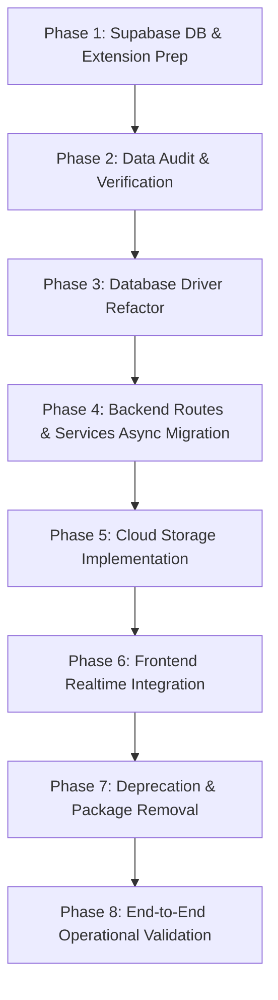

# 🐘 KATL Operations: Complete Supabase Migration & Architecture Master Plan
**Database Expert Analysis, Architecture Blueprint, and Step-by-Step Implementation Guide**

---

## 1. Executive Summary & Expert Database Architectural Assessment

### 1.1 The Verdict
Migrating **KATL Operations** entirely to **Supabase (PostgreSQL 17)** as the **single source of truth** and completely eliminating **SQLite (`better-sqlite3`)** is not merely an improvement—it is an **architectural necessity** for the operational lifecycle of this enterprise operations platform.

### 1.2 Critical Flaws in the Current Dual / SQLite Architecture

1. **The Worker Thread / `SharedArrayBuffer` Polyfill Anti-Pattern**:
   - The current `src/server/db/index.ts` contains a 280-line bridge using Node.js `worker_threads`, `SharedArrayBuffer`, and `Atomics.wait()` to force asynchronous PostgreSQL queries into synchronous `better-sqlite3`-style calls (`db.prepare().get()`).
   - **Why this is dangerous in production**:
     - `Atomics.wait` **blocks the Node.js event loop thread** for up to 30 seconds per query, neutralizing Node's non-blocking I/O advantages.
     - The shared memory buffer is hardcoded to 8MB (`DATA_SIZE = 8 * 1024 * 1024`), which will crash or truncate under larger data dumps or bulk reporting queries.
     - Runtime regex SQL rewriting (`?` → `$1`, date function substitutions, `INSERT OR REPLACE` transforms) is fragile, prone to SQL injection risks, and incurs parsing overhead on every query execution.
2. **Ephemeral Local Storage in Cloud Environments**:
   - SQLite stores data in local files (`data/katl_ops.db`, `data.db`, `local.db`). When deploying to modern cloud container platforms (Vercel, Render, Cloud Run, AWS ECS, Fly.io), the container filesystem is **ephemeral**. Every deployment or auto-restart destroys new records unless persistent network volumes are attached (which introduce severe SQLite file-locking bugs).
3. **Absence of Native Realtime**:
   - The current frontend relies on periodic polling intervals (8–10 seconds) to check for task updates. Supabase provides native PostgreSQL Write-Ahead Log (WAL) replication over WebSockets, transforming task transitions into **instant (<100ms) UI updates**.
4. **Dispersed File Storage**:
   - Media uploads (staff check-in selfies and audio help slips) are written to local disk (`uploads/`), which cannot scale horizontally and gets lost on cloud redeployment. Supabase Storage natively integrates S3-compatible cloud object storage with automated lifecycle policies.

---

## 2. Target Architecture: Supabase as the Exclusive Database

```
+-----------------------------------------------------------------------------------+
|                                  CLIENT TIER                                      |
|                                                                                   |
|   +-------------------------------------+   +---------------------------------+   |
|   |         React 19 / Vite App         |   |    Supabase JS Client (v2)      |   |
|   |  - Mobile Staff Dashboard           |   |  - Realtime WebSocket channels  |   |
|   |  - Mandate / Owner Control Tower    |   |  - Live Work Item card updates  |   |
|   +------------------+------------------+   +----------------+----------------+   |
+----------------------|---------------------------------------|--------------------+
                       | HTTPS API                             | WSS (pg_changes)
                       v                                       |
+------------------------------------------------------+       |
|                 APPLICATION SERVER                   |       |
|                                                      |       |
|   +----------------------------------------------+   |       |
|   |     Fastify 5 Backend (Node.js / TS)         |   |       |
|   |  - JWT Authentication & RBAC                 |   |       |
|   |  - Scoring Engine & IST Work Window Rules    |   |       |
|   |  - FMS Flow State Machines & Delegation Cron |   |       |
|   +----------------------+-----------------------+   |       |
|                          |                           |       |
|   +----------------------v-----------------------+   |       |
|   |      Native Async PostgreSQL Driver          |   |       |
|   |      (postgres.js / pg Connection Pool)      |   |       |
|   +----------------------+-----------------------+   |       |
+--------------------------|---------------------------|-------+
                           | SSL (Pooled: 6543)        |
                           v                           v
+-----------------------------------------------------------------------------------+
|                           SUPABASE CLOUD INFRASTRUCTURE                           |
|                                                                                   |
|   +------------------------+  +------------------------+  +-------------------+   |
|   | PostgreSQL 17 Engine   |  | Supabase Realtime      |  | Supabase Storage  |   |
|   | - 18 Relational Tables |  | - Broadcast WAL changes|  | - 'selfies'       |   |
|   | - JSONB & Timestamptz  |  | - Instant UI updates   |  | - 'help-audio'    |   |
|   | - RLS Security & Locks |  | - Zero Polling Lag     |  | - 45-day auto cron|   |
|   +------------------------+  +------------------------+  +-------------------+   |
|                                                                                   |
+-----------------------------------------------------------------------------------+
```

---

## 3. Schema & Data Model Transition Specification

The complete database consists of **18 operational tables**, all normalized for PostgreSQL:

| # | Table Name | Purpose | Key Type Changes (SQLite → PostgreSQL) |
|---|---|---|---|
| 1 | `users` | Staff, Mandate & Owner identities | `role` enum CHECK, `is_active` (`BOOLEAN`), `created_at` (`TIMESTAMPTZ`) |
| 2 | `designations` | Job roles & operational departments | Unique `name`, standard relational keys |
| 3 | `user_designations` | Multi-role assignment (Many-to-Many) | Composite Primary Key `(user_id, designation_id)` with `ON DELETE CASCADE` |
| 4 | `designation_capabilities` | Capability flags (Audit, Delay, etc.) | Composite Primary Key `(designation_id, capability)` |
| 5 | `user_systems` | Module access (`CL`, `O2D`, `Purchase`) | Composite Primary Key `(user_id, system_code)` |
| 6 | `checklist_definitions` | Master recurring task definitions | `is_important`, `is_compliance` (`BOOLEAN`), `frequency` CHECK |
| 7 | `designation_task_templates` | Designation-specific task templates | `priority`, `task_type` CHECK, `BOOLEAN` flags |
| 8 | `master_lists` | Dropdowns (fabrics, transports, agents) | `extra_json` stored as native **`JSONB`** with indexing |
| 9 | `holidays` | Operational holiday calendar | `date` stored as native `DATE` type |
| 10 | `fms_flow_instances` | Order & Purchase FMS workflows | `all_form_data` as **`JSONB`**, `started_at`/`completed_at` as `TIMESTAMPTZ` |
| 11 | `work_items` | Real-time task cards (Heart of Ops) | `is_important` (`BOOLEAN`), `available_from`/`planned_at` (`TIMESTAMPTZ`), `queue_wait_hours`/`delay_hours` (`DOUBLE PRECISION`) |
| 12 | `fms_step_instances` | Flow execution steps & forms | `form_data` as **`JSONB`**, `available_from`/`planned_at` (`TIMESTAMPTZ`) |
| 13 | `fms_deleted_repository` | Soft-deleted flow audit archive | `full_snapshot_json` as **`JSONB`**, `deleted_at` (`TIMESTAMPTZ`) |
| 14 | `score_events` | MIS Scoring & On-Time Performance ledger | `is_done`, `is_on_time` (`BOOLEAN`), `updated_at` (`TIMESTAMPTZ`) |
| 15 | `delegations` | Manager ad-hoc task delegation | `questions_json` as **`JSONB`**, `tat_hours` (`DOUBLE PRECISION`), `BOOLEAN` flags |
| 16 | `help_slips` | Staff query tickets with audio notes | `status` CHECK (`ASKED`, `ANSWERED`, `UNDERSTOOD`), `TIMESTAMPTZ` timestamps |
| 17 | `audit_logs` | Random audit & verification records | `audit_date` (`TIMESTAMPTZ`), `result` CHECK (`VERIFIED`, `FALSE`) |
| 18 | `queue_snapshots` | Bottleneck analytics snapshots | `snapshot_at` (`TIMESTAMPTZ`), wait hours (`DOUBLE PRECISION`) |

### Essential Performance Indexes
```sql
-- Work Items Query Acceleration
CREATE INDEX IF NOT EXISTS idx_work_items_assignee ON public.work_items(assignee_user_id, status);
CREATE INDEX IF NOT EXISTS idx_work_items_planned ON public.work_items(planned_at);
CREATE INDEX IF NOT EXISTS idx_work_items_source ON public.work_items(source_module, source_ref_id);

-- Scoring Engine Week Aggregations
CREATE INDEX IF NOT EXISTS idx_score_events_user_week ON public.score_events(user_id, week_start_date);

-- FMS & Delegation Operations
CREATE INDEX IF NOT EXISTS idx_fms_step_assignee ON public.fms_step_instances(assignee_user_id, status);
CREATE INDEX IF NOT EXISTS idx_delegations_assignee ON public.delegations(assignee_user_id, status);
CREATE INDEX IF NOT EXISTS idx_help_slips_status ON public.help_slips(status);
CREATE INDEX IF NOT EXISTS idx_master_lists_key ON public.master_lists(list_key);
```

---

## 4. Architectural Transformation Details

### 4.1 Database Access Layer: From Synchronous Hack to Clean Async Pool

#### Current Legacy Code (`src/server/db/index.ts`):
```typescript
// ❌ Dangerous: Blocks OS thread using Atomics.wait
function execSync(query: string, params: unknown[] = []) {
  Atomics.store(signalArr, 0, 0);
  worker.postMessage({ query, params });
  const waitResult = Atomics.wait(signalArr, 0, 0, 30_000);
  ...
}
```

#### New Supabase Native Client (`src/server/db/index.ts`):
```typescript
// ✅ Clean, High-Performance Async Connection Pool
import postgres from 'postgres';
import * as dotenv from 'dotenv';
dotenv.config();

const DATABASE_URL = process.env.DATABASE_URL;
if (!DATABASE_URL) {
  throw new Error('FATAL: DATABASE_URL environment variable is required.');
}

// Transaction mode pooler configuration for Supabase
export const sql = postgres(DATABASE_URL, {
  max: 20,                  // Concurrent connection limit
  idle_timeout: 30,         // Close idle connections after 30s
  connect_timeout: 10,      // Connection timeout
  ssl: 'require',           // Mandatory for Supabase
  transform: {
    undefined: null,        // Automatically map undefined to NULL
  },
});

export async function query<T = any>(queryString: string, params: unknown[] = []): Promise<T[]> {
  const result = await sql.unsafe(queryString, params as any);
  return Array.from(result) as T[];
}

export async function queryOne<T = any>(queryString: string, params: unknown[] = []): Promise<T | null> {
  const rows = await query<T>(queryString, params);
  return rows.length > 0 ? rows[0] : null;
}

export async function execute(queryString: string, params: unknown[] = []): Promise<{ count: number }> {
  const result = await sql.unsafe(queryString, params as any);
  return { count: result.count ?? 0 };
}
```

---

### 4.2 Service Layer Refactoring (`WorkItemService`)

Transactions in PostgreSQL are fully asynchronous and ACID compliant:

```typescript
export class WorkItemService {
  public static async createWorkItem(dto: CreateWorkItemDTO): Promise<string> {
    const id = randomUUID();
    const now = new Date().toISOString();
    const weight = dto.is_important ? 3 : 1;
    const weekStartDate = getMondayOfWeekIST(dto.planned_at);
    const taskType = dto.task_type || (
      dto.source_module === 'fms' ? 'FMS' :
      dto.source_module === 'delegation' ? 'DELEGATION' : 'REPETITIVE'
    );

    // Atomic PostgreSQL Transaction
    await sql.begin(async (tx) => {
      await tx`
        INSERT INTO public.work_items (
          id, source_module, source_ref_id, fms_code, step_no,
          assignee_user_id, title_en, title_hi, is_important,
          available_from, planned_at, status, created_at, task_type
        ) VALUES (
          ${id}, ${dto.source_module}, ${dto.source_ref_id}, ${dto.fms_code || null}, ${dto.step_no || null},
          ${dto.assignee_user_id}, ${dto.title_en}, ${dto.title_hi}, ${Boolean(dto.is_important)},
          ${dto.available_from.toISOString()}, ${dto.planned_at.toISOString()}, 'OPEN', ${now}, ${taskType}
        )
      `;

      await tx`
        INSERT INTO public.score_events (
          id, user_id, work_item_id, week_start_date, weight, is_done, is_on_time, updated_at
        ) VALUES (
          ${randomUUID()}, ${dto.assignee_user_id}, ${id}, ${weekStartDate}, ${weight}, FALSE, FALSE, ${now}
        )
      `;
    });

    return id;
  }
}
```

---

### 4.3 Supabase Realtime Pub/Sub Engine

Enable the React frontend to subscribe directly to PostgreSQL changes:

```typescript
// src/client/context/RealtimeContext.tsx
import { createClient } from '@supabase/supabase-js';

const supabaseUrl = import.meta.env.VITE_SUPABASE_URL;
const supabaseAnonKey = import.meta.env.VITE_SUPABASE_ANON_KEY;

export const supabase = createClient(supabaseUrl, supabaseAnonKey);

export function subscribeToLiveWorkItems(userId: string, onUpdate: () => void) {
  return supabase
    .channel(`user-work-items-${userId}`)
    .on(
      'postgres_changes',
      {
        event: '*',
        schema: 'public',
        table: 'work_items',
        filter: `assignee_user_id=eq.${userId}`,
      },
      (payload) => {
        console.log('⚡ Realtime task update received:', payload);
        onUpdate();
      }
    )
    .subscribe();
}
```

---

### 4.4 Supabase Cloud Storage & 45-Day Lifecycle Policy

Replace local disk writes (`uploads/`) with Supabase Storage:

```typescript
import { createClient } from '@supabase/supabase-js';

const supabaseAdmin = createClient(
  process.env.SUPABASE_URL!,
  process.env.SUPABASE_SERVICE_ROLE_KEY!
);

export async function uploadMediaToSupabase(
  bucket: 'selfies' | 'help-slip-audio',
  filePath: string,
  buffer: Buffer,
  contentType: string
): Promise<string> {
  const { data, error } = await supabaseAdmin.storage
    .from(bucket)
    .upload(filePath, buffer, {
      contentType,
      upsert: true,
    });

  if (error) throw new Error(`Supabase Storage Error: ${error.message}`);

  const { data: publicData } = supabaseAdmin.storage
    .from(bucket)
    .getPublicUrl(filePath);

  return publicData.publicUrl;
}
```

#### Automated 45-Day Cleanup via `pg_cron`:
```sql
CREATE OR REPLACE FUNCTION public.cleanup_old_storage_files()
RETURNS void
LANGUAGE plpgsql
SECURITY DEFINER
AS $$
BEGIN
    DELETE FROM storage.objects
    WHERE bucket_id IN ('selfies', 'help-slip-audio')
      AND created_at < NOW() - INTERVAL '45 days';
END;
$$;

-- Schedule nightly execution at 3:00 AM IST (21:30 UTC)
SELECT cron.schedule(
    'cleanup-old-media-daily',
    '30 21 * * *',
    'SELECT public.cleanup_old_storage_files()'
);
```

---

## 5. Step-by-Step Migration Implementation Plan



### Phase 1: Supabase Environment & Schema Finalization
1. **Verify Supabase Project Credentials**:
   - Ensure `.env` has valid `SUPABASE_URL`, `SUPABASE_ANON_KEY`, `SUPABASE_SERVICE_ROLE_KEY`, and `DATABASE_URL`.
2. **Apply Complete Schema**:
   - Execute `supabase_schema.sql` to ensure all 18 tables, indexes, realtime publications, and storage buckets are configured.
3. **Verify Extensions**:
   - Ensure `uuid-ossp`, `pg_trgm`, and `pg_cron` extensions are enabled.

### Phase 2: Data Migration & Consistency Verification
1. **Validate Record Counts in Supabase**:
   - Verify `users` (28), `designations` (13), `user_designations` (26), `designation_capabilities` (5), `user_systems` (39), `checklist_definitions` (155), `master_lists` (29), `holidays` (7), `work_items`, and `score_events`.
2. **Foreign Key Integrity Check**:
   - Run verification queries to ensure zero orphan foreign keys in `work_items`, `score_events`, `delegations`, and `help_slips`.

### Phase 3: Database Driver & Connection Layer Replacement
1. **Refactor `src/server/db/index.ts`**:
   - Remove `worker_threads`, `SharedArrayBuffer`, and `better-sqlite3` imports.
   - Implement the connection pool using `postgres` (porsager/postgres) or `pg` with native async methods.
2. **Update Type Definitions**:
   - Export typed query helpers (`query`, `queryOne`, `execute`, `sql`).

### Phase 4: Backend Services & API Route Async Modernization
1. **Modernize `WorkItemService`**:
   - Convert all methods (`createWorkItem`, `completeWorkItem`, `markFirstOpened`, `flagFalse`, `overrideDone`) to `async/await`.
2. **Refactor Route Handlers in `src/server/index.ts`**:
   - Update all endpoints (Auth, Work Items, Score, Delegations, Help Slips, FMS, Master Lists, Holidays, Admin) from synchronous `db.prepare()` calls to `await sql` / `await query()`.
3. **Refactor `src/server/seed.ts`**:
   - Update seed logic to use async PostgreSQL queries with `ON CONFLICT DO NOTHING`.

### Phase 5: Media Upload & Storage Migration
1. **Update `/api/upload` Endpoint**:
   - Switch from local filesystem writes (`uploads/`) to Supabase Storage client (`selfies` and `help-slip-audio` buckets).
2. **Setup Cloud Media Auto-Purge**:
   - Register the 45-day cleanup cron job.

### Phase 6: Frontend Realtime Integration
1. **Install & Initialize `@supabase/supabase-js`** on the client.
2. **Implement Realtime Subscriptions**:
   - Replace or supplement UI polling in `UserHomeView`, `MandateHomeView`, and `OwnerOverviewView` with live WebSocket listener channels.

### Phase 7: Deprecation & Cleanup
1. **Uninstall SQLite Dependencies**:
   - `npm uninstall better-sqlite3 @types/better-sqlite3`
2. **Purge Local Database Files**:
   - Delete `data/katl_ops.db`, `data.db`, `local.db`, and the `data/` folder.
3. **Update Configuration**:
   - Ensure `.gitignore` ignores any temporary export artifacts and enforces Supabase-only operation.

### Phase 8: Verification & End-to-End Testing
1. **Automated Unit Tests**:
   - Run `npm run test` (Vitest) for scoring engine and working time calculations.
2. **Auth & Role Flows**:
   - Test Worker PIN login (`7771002882` / `1234`), Mandate login, Owner login.
3. **Operational Scenarios**:
   - Task completion & scoring recalculation.
   - Daily 8:00 PM IST cutoff enforcement.
   - Delegation creation & auto-replacement.
   - Help slip raising with audio and instant status resolution.
   - FMS Order-to-Delivery step transitions.

---

## 6. Risk Assessment, Rollback & Resilience Matrix

| Risk Scenario | Impact | Mitigation Strategy |
|---|---|---|
| **Network Latency / Internet Outage** | Server unable to connect to Supabase | Deploy backend in the same cloud region (e.g. AWS `ap-south-1` Mumbai or `ap-northeast-2` Seoul) with keep-alive connection pooling. |
| **Connection Pool Exhaustion** | Fastify request timeouts under peak shift check-in | Use Supabase Transaction Pooler (`pgbouncer=true` on port `6543`) with `max: 20` client connections. |
| **Data Type Mismatch (e.g. Boolean vs 0/1)** | Frontend expectation of integer booleans | PostgreSQL driver maps `BOOLEAN` to JavaScript `true`/`false`. Client TypeScript types are audited and aligned. |
| **Storage Quota Exceeded** | Image/audio upload failures | 45-day automated auto-purge function cleans expired media continuously; free tier includes 1GB bucket space. |

---

*Authored by Antigravity Database Architecture Team — KATL Operations Core*
