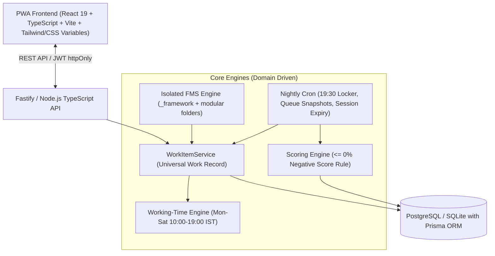

# Implementation Plan — Ketan Aditya Ops (Phase 1)

Comprehensive blueprint to build the **Ketan Aditya Ops** internal operations web application from start to finish. Built specifically for **30–40 factory, warehouse, and operations staff** on Android mobile devices, with desktop/tablet responsive headroom for Mandate Holders and the Owner.

---

## 1. Executive Summary & Tech Architecture



### Core Tech Stack:
- **Frontend:** React 19, TypeScript, Vite, Tailwind CSS (configured with strict Navy/Hot-Pink/Light-Pink token palette), Lucide Icons, Canvas Client-Side Image Compressor, Web Audio API Recorder.
- **Backend:** Node.js LTS, TypeScript, Fastify (high performance, minimal overhead for 3G networks), Prisma ORM.
- **Database:** PostgreSQL (or local SQLite for dev/reproducibility) with strict schema, migrations, and seed scripts.
- **Background Tasks & Jobs:** `node-cron` for 19:30 checklist locking, midnight queue snapshots, 04:00 IST session expiry.
- **Authentication:** 
  * **Owner:** `hello@ketan` / `Hello@Ketan`
  * **Mandate Holder (Master Admin):** `mis@ketan` / `MIS@Ketan`
  * **Users (26 Staff Members):** Mobile Number + 4-digit PIN (default PIN `1234` initialized for all staff from `user_list.csv`, with Mandate Holder PIN reset flow).

---

## 2. Palette, Design Tokens & UI Aesthetics

Per Section 14 of the PRD:
- **Primary / Structure:** Navy Blue (`#0B192C`, `#1E3E62`, `#001F3F`)
- **Action / Emphasis:** Hot Pink (`#FF007F`, `#E11D48`)
- **Late / Missed / Flagged False / Warning:** Light Pink (`#FFF1F2`, `#FFE4E6`, text `#BE123C`, border `#FDA4AF`) — *Never a generic harsh red*
- **Surface / Background:** Off-white & Glass Card (`#F8FAFC`, `#FFFFFF`, subtle borders `#E2E8F0`)
- **Typography:** `Plus Jakarta Sans` / `Inter` paired with `Noto Sans Devanagari` for Hindi
- **Touch targets:** Minimum 48px × 48px on all action buttons and inputs for blue-collar mobile usage.

---

## 3. Database Schema Design (Prisma)

### Tables to Create:
1. `User`: id, name, mobile, email, pin_hash, role (`OWNER`, `MANDATE_HOLDER`, `USER`), selfie_url, is_active, created_at.
2. `Designation`: id, name, department.
3. `UserDesignation`: user_id, designation_id.
4. `DesignationCapability`: designation_id, capability (`DELAY_DASHBOARD`, `AUDIT`, `DELEGATION_SHEET`, `VIDEO_BACKLOG`, `IMPORTANT_MISS_ALERT`).
5. `WorkItem`: id, source_module (`checklist`, `fms`, `delegation`), source_ref_id, fms_code, step_no, assignee_user_id, title_en, title_hi, is_important, available_from, planned_at, first_opened_at, completed_at, completed_by, queue_wait_hours, delay_hours, status (`OPEN`, `DONE`, `MISSED`, `FLAGGED_FALSE`), locked_at, created_at.
6. `ScoreEvent`: id, user_id, work_item_id, week_start_date, weight (1 or 3), is_done, is_on_time, updated_at.
7. `ChecklistDefinition`: id, title_en, title_hi, target_type (`DESIGNATION`, `USER`), target_id, frequency (`DAILY`, `WEEKLY`, `MONTHLY`, `QUARTERLY`, `YEARLY`), start_date, due_time, is_important, video_url, is_active.
8. `FmsFlowInstance`: id, fms_code, display_number, status (`ACTIVE`, `COMPLETED`, `DELETED`), current_step, started_by, started_at, completed_at.
9. `FmsStepInstance`: id, flow_id, step_no, repeat_index, assignee_user_id, status, form_data (JSON), completed_at.
10. `DelegationTask`: id, created_by, assignee_user_id, title_en, title_hi, tat_hours, is_important, questions (JSON), status, change_request_text, change_request_status.
11. `HelpSlip`: id, raised_by, audio_url, text_content, status (`ASKED`, `ANSWERED`, `UNDERSTOOD`), answer_text, answered_by, created_at, answered_at, understood_at.
12. `MasterList`: id, list_key, item_value, extra_json.
13. `Holiday`: id, date, title.
14. `QueueSnapshot`: id, snapshot_at, source_module, fms_code, step_no, designation_id, items_waiting, oldest_item_wait_hours, avg_wait_hours.

---

## 4. Detailed Component & Implementation Breakdown

### Phase A: Core Foundation & Engines
1. **Working-Time Engine (`src/core/working-time/`)**
   - Implement `addWorkingTime(start, hours)`: Handles 10:00–19:00 IST window, skips Sundays & Holidays.
   - Implement `workingHoursBetween(a, b)`: Calculates net working hours elapsed.
   - Implement `nextWorkingDay(date)` & `isWorkingTime(date)`.
   - Comprehensive test suite covering all edge cases (holidays, weekend crossings, start before/after hours).

2. **Universal Work Item Service (`src/core/work-items/`)**
   - Central write service enforcing Law 2 (`available_from`, `planned_at`, named `assignee_user_id`).
   - Handles status transitions (`OPEN` $\to$ `DONE` / `MISSED` / `FLAGGED_FALSE`).
   - Automatically writes/updates `ScoreEvent` without leaking module logic.

3. **Scoring Engine (`src/core/scoring/`)**
   - Strictly implements Section 7 formulas:
     $$\text{Work Done} = -\text{round}\left(100 - \frac{\text{weighted\_done}}{\text{weighted\_due}} \times 100\right)\%$$
     $$\text{Work On Time} = -\text{round}\left(100 - \frac{\text{weighted\_on\_time}}{\text{weighted\_due}} \times 100\right)\%$$
   - Filters by Monday–Saturday week of `planned_at`.
   - Generates "Not Done" breakdown list (with pink highlight for `FLAGGED_FALSE` by audit).
   - Zero score for zero work. Hard test rule: no positive score rendered anywhere.

---

### Phase B: Seed Data & Authentication Layer
1. **User & Master Seed (`src/server/seed.ts`)**
   - Import and parse `user_list.csv`.
   - Create Owner (`hello@ketan` / `Hello@Ketan`).
   - Create Mandate Holder (`mis@ketan` / `MIS@Ketan`).
   - Seed all 26 users with mobile numbers, designations, and departments (e.g. Akash Soni, Ashok Bhalse, Kanchan Kori, Harsh Malakar, Sapna Sahu, KR, etc.).
   - Seed initial designations and assign capability defaults (Process Coordinator $\to$ `DELAY_DASHBOARD`, `AUDIT`; Executive Assistant $\to$ `DELEGATION_SHEET`, `IMPORTANT_MISS_ALERT`; MIS $\to$ `VIDEO_BACKLOG`).
   - Seed standard Indian holidays for 2026/2027.

2. **Auth API & PIN Management**
   - Mobile + 4-digit PIN login with rate limiting (5 attempts per 15 min).
   - Username/Password login for Owner & Mandate Holder.
   - Mandate Holder one-time PIN Reset generator (4-digit temporary PIN shown once on screen).
   - Compulsory selfie upload & preview.
   - Server-side guard: Users with no designation receive zero company data.

---

### Phase C: Isolated FMS Framework & Standard Modules
1. **FMS Engine (`src/fms/_framework/`)**
   - Auto-discovers FMS folders in `src/fms/`.
   - Number generator (`<CODE>-<FY>-<SERIAL>`, e.g., `O2D-2627-0001`).
   - Step advancement logic, branching (`goto_step`), repeatable partial dispatches, and settlement lock.
   - Bill Sequence gap detector helper (`bill-sequence.ts`).

2. **Standard Phase 1 FMS Definitions:**
   - **Order-to-Delivery (O2D):** Step 1: Order Entry (dynamic lead time) $\to$ Step 2: Repeatable Dispatch Entry $\to$ Step 3: Complete Order (settlement).
   - **Purchase (PUR):** Requisition $\to$ PO $\to$ Vendor Acknowledgment $\to$ Inward GRN $\to$ QC.
   - **Job Slip (JS):** Naame $\to$ Unfinished Maal Jama $\to$ Press $\to$ Finished Maal Jama (with Cut-to-Pack branching).

---

### Phase D: Checklist, Help Slip & Delegation Modules
1. **Checklist Module:**
   - Recurring generator for Daily, Weekly, Monthly, Quarterly, Yearly schedules.
   - YouTube video link embedding for training.
   - 19:30 IST Auto-Lock cron job.
   - Mandate Holder override for missed tasks.

2. **Help Slip System:**
   - 3-step loop: Ask (Text or in-browser Voice Note) $\to$ Answer (Owner/Mandate) $\to$ "I Understood" (auto-hides).
   - Audio recording & playback widget.

3. **Delegation Sheet:**
   - One-off task assignment with photo preview, TAT, and weight.
   - One-tap WhatsApp deep link button generator (`https://wa.me/91<mobile>?text=...`).
   - 2-day window for assignee change requests with approve/deny workflows.

---

### Phase E: Frontend Role Interfaces & Capability Dashboards
1. **Role-Shaped Layouts:**
   - **Regular User (3 tabs):** 1. Home (Pending work, Help slip trigger), 2. Score (My negative scores, Not Done list), 3. My Systems (Active flows, completed work).
   - **Mandate Holder (4 tabs):** 1. Home, 2. Score (Own & Company-wide scores), 3. Systems (Live FMS & Overrides), 4. Manage (Users, PINs, Designations, Checklists, Master Lists, Help Slips, Holidays).
   - **Owner (4 tabs):** 1. Overview (Missed-important alerts, late tasks, FMS live counters, open help slips), 2. Scores (Team scores + Excel/CSV export), 3. Systems (All FMS + Deleted Repository), 4. Manage (Master settings & financial controls).

2. **Capability Blocks:**
   - **Process Coordinator:** Delay Dashboard (with 1-tap Call & WhatsApp) + Daily Random Audit Sampler (10 random tasks/day with Verified/False buttons).
   - **Executive Assistant:** Delegation Sheet + Change Request Approvals + Missed Important Alert Box.
   - **MIS Executive:** Video Backlog Tracker (checklists missing videos) + System Health Monitor.

3. **Trilingual Language Selector:**
   - Instant live toggle between **English**, **हिंदी (Devanagari)**, and **Hindi (Roman - Hinglish)**.

---

## 5. File Structure Plan

```
KATL-operations/
├── PRD_Ketan_Aditya_Ops.md
├── user_list.csv
├── package.json
├── tsconfig.json
├── vite.config.ts
├── tailwind.config.js
├── prisma/
│   ├── schema.prisma
│   └── seed.ts
├── src/
│   ├── server/
│   │   ├── index.ts
│   │   ├── routes/
│   │   │   ├── auth.ts
│   │   │   ├── work-items.ts
│   │   │   ├── scoring.ts
│   │   │   ├── checklist.ts
│   │   │   ├── fms.ts
│   │   │   ├── delegation.ts
│   │   │   ├── helpslip.ts
│   │   │   ├── audit.ts
│   │   │   └── admin.ts
│   │   ├── services/
│   │   │   ├── workItemService.ts
│   │   │   ├── scoringService.ts
│   │   │   ├── workingTimeService.ts
│   │   │   └── cronService.ts
│   │   └── utils/
│   ├── core/
│   │   ├── working-time/
│   │   │   ├── engine.ts
│   │   │   └── engine.test.ts
│   │   └── scoring/
│   │       ├── engine.ts
│   │       └── engine.test.ts
│   ├── fms/
│   │   ├── _framework/
│   │   │   ├── engine.ts
│   │   │   ├── types.ts
│   │   │   ├── registry.ts
│   │   │   ├── numbering.ts
│   │   │   └── bill-sequence.ts
│   │   ├── order-to-delivery/
│   │   │   ├── definition.ts
│   │   │   └── index.ts
│   │   ├── purchase/
│   │   │   ├── definition.ts
│   │   │   └── index.ts
│   │   └── job-slip/
│   │       ├── definition.ts
│   │       └── index.ts
│   └── client/
│       ├── index.html
│       ├── main.tsx
│       ├── App.tsx
│       ├── i18n/
│       │   └── translations.ts
│       ├── styles/
│       │   └── index.css
│       ├── context/
│       │   ├── AuthContext.tsx
│       │   └── LanguageContext.tsx
│       ├── components/
│       │   ├── layout/
│       │   │   ├── Header.tsx
│       │   │   ├── BottomNav.tsx
│       │   │   └── AppShell.tsx
│       │   ├── work/
│       │   │   ├── UniversalWorkCard.tsx
│       │   │   └── WorkItemModal.tsx
│       │   ├── score/
│       │   │   ├── ScoreGauge.tsx
│       │   │   └── NotDoneList.tsx
│       │   ├── help/
│       │   │   ├── AudioRecorder.tsx
│       │   │   └── HelpSlipModal.tsx
│       │   └── common/
│       │       ├── Button.tsx
│       │       ├── Badge.tsx
│       │       └── Modal.tsx
│       └── views/
│           ├── auth/
│           │   ├── LoginView.tsx
│           │   └── SignupView.tsx
│           ├── user/
│           │   ├── UserHomeView.tsx
│           │   ├── UserScoreView.tsx
│           │   └── UserSystemsView.tsx
│           ├── mandate/
│           │   ├── MandateHomeView.tsx
│           │   ├── MandateScoreView.tsx
│           │   ├── MandateSystemsView.tsx
│           │   └── MandateManageView.tsx
│           ├── owner/
│           │   ├── OwnerOverviewView.tsx
│           │   ├── OwnerScoreView.tsx
│           │   ├── OwnerSystemsView.tsx
│           │   └── OwnerManageView.tsx
│           └── capabilities/
│               ├── DelayDashboardView.tsx
│               ├── AuditView.tsx
│               └── DelegationView.tsx
```

---

## 6. Verification & Testing Plan

### Automated Tests:
1. **Working Time Engine Test Suite:**
   - Mon–Sat 10:00–19:00 boundary tests.
   - Sunday exclusion & custom Holiday leap tests.
   - Overnight & multi-day TAT computation tests.
2. **Scoring Engine Invariants:**
   - Test $\le 0\%$ rule on all scoring outputs.
   - Test $3\times$ weight for `is_important` items.
   - Test that audit `FLAGGED_FALSE` updates `is_done` and reflects in Not Done list.
3. **FMS Engine Isolation:**
   - Test step advancement, dynamic lead time resolution, and repeatable balance deductions.

### Manual & End-to-End Verification:
1. **Auth Verification:**
   - Log in as Owner (`hello@ketan` / `Hello@Ketan`) $\to$ verify Overview & financial views.
   - Log in as Mandate Holder (`mis@ketan` / `MIS@Ketan`) $\to$ verify Manage tabs, reset PIN flow.
   - Log in as User (e.g. `7771002882` / `1234` Akash Soni) $\to$ verify 3-tab layout, assigned work items, score displays.
2. **Checklist & 19:30 Lock Verification:**
   - Create a daily checklist $\to$ complete as staff $\to$ verify score update.
3. **Help Slip Voice & Text Workflow:**
   - Record voice note on mobile browser $\to$ review as Mandate Holder $\to$ submit answer $\to$ tap "I Understood" as user.
4. **Delegation & WhatsApp Integration:**
   - Assign one-off task $\to$ trigger WhatsApp link $\to$ submit change request $\to$ approve change request.
5. **Language Switcher:**
   - Switch between English, हिन्दी, and Hinglish across all cards, modals, and navigation headers.
